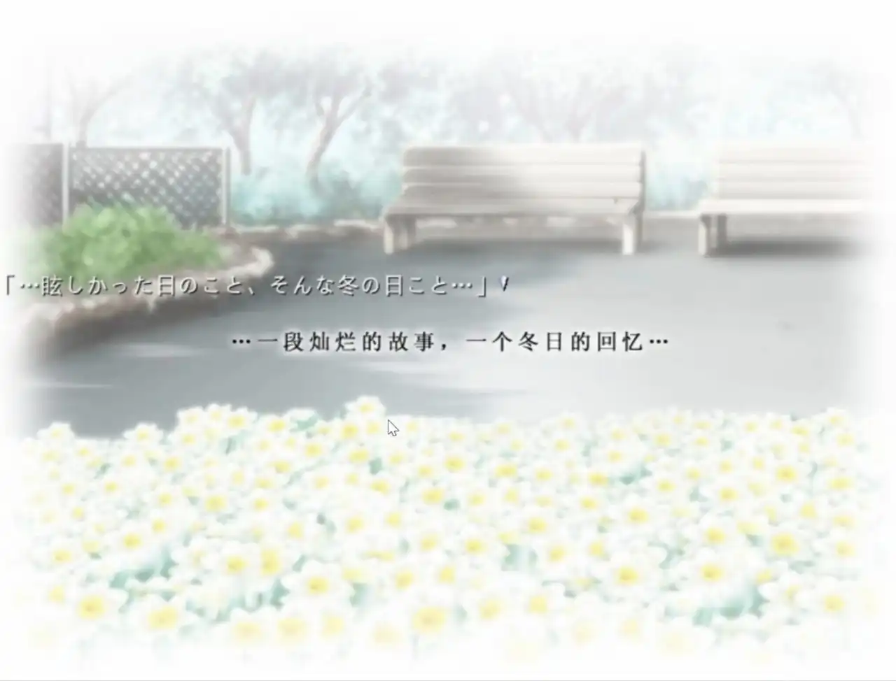

---

title: 一段灿烂的故事，一个冬日的回忆
published: 2026-01-20
description: 《Narcissus》推后感
tags: [Gal,随笔]
category: Gal
draft: false

---

## 一段灿烂的故事，一个冬日的回忆

推完了水仙1和水仙2，在推的时候哭了好几次，眼泪不自觉的就流了出来。水仙真的是我第一部这样的游戏，而且音乐也是极好的，水仙还是太超模了。
水仙虽然是零几年的作品，但是真的值得玩一玩。  
虽然只是两个故事，但是很容易让人深思。最让我难以忘怀的是水仙1里面的  
-你会…拉住我吗  
-你…希望我拉住你吗  

我也在思考这个问题，如果真的有一天，我到了这种境界，我会怎么做呢，最终只能得到那个答案「不知道」，对于我来说，果然还是以后的事，以后在说吧。  
而且在水仙2里面对于姬子的话也是照应了津美子的问题了，姬子也问过同样的问题。  
里面的尼洛和阿洛伊斯（姬子）的故事和终章那个7F的传承也让我挺感动的。 让我在缓两天吧，可能还会在去推水仙3，但是果然还是先让我缓几天吧  