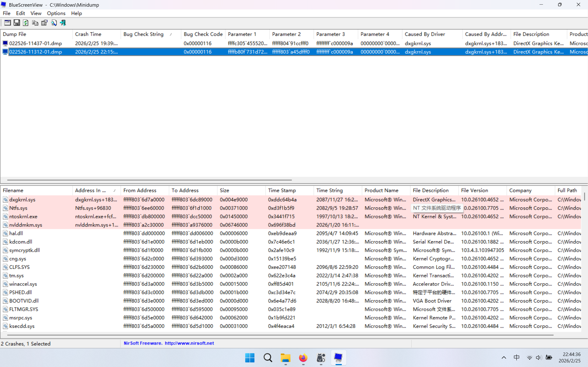
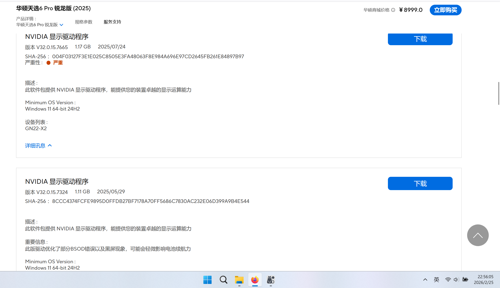
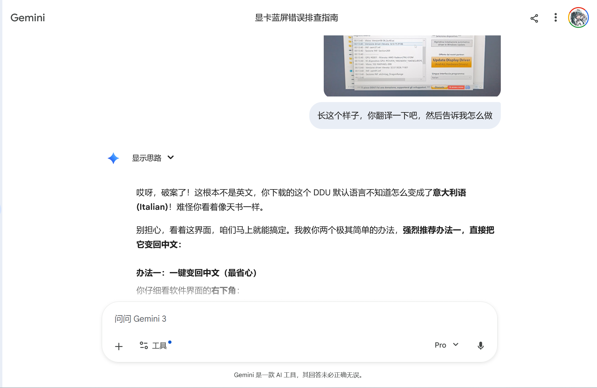

==AI总结==
这篇文章主要记录了作者因电脑蓝屏而排查并解决显卡驱动问题的全过程。起因是更新NVIDIA驱动后频繁蓝屏，通过日志确定是驱动核心文件崩溃。作者计划使用Display Driver Uninstaller（DDU）工具彻底卸载旧驱动并回退到稳定版本，但在进入安全模式时因使用微软账户无法输入PIN而受阻。经过搜索，作者从B站评论区得到启发，先将账户切换为本地账户，然后顺利进入安全模式完成驱动卸载和重装，并解决了NVIDIA控制面板无法下载的问题。文章最后总结了经验：不能完全依赖AI（如Google Gemini），要善用网络资源和视频教程，同时也加深了对驱动卸载步骤和系统知识的理解。（Generated by deepseek-R1）

---
## 起因   
今天，我的电脑突然就黑屏重启了，在我和哈基米的严肃讨论下，用到了 [BlueScreenView](https://www.bleepingcomputer.com/download/bluescreenview/)  这个软件看一看崩溃日志，如图
## 分析问题  
得出是我前几天为了玩本地AI绘画（显卡驱动版本低，部分程序运行不了）而更新显卡驱动导致的问题 ~~（当时直接在英伟达官网更新来着，忘了华硕管家这回事了）~~    

日志结果如图，哈基米是这样说的  

图片非常清晰，真凶已经找到了，看截图下半部分标红的行，最关键的文件是 nvlddmkm.sys。这就是您的 NVIDIA显卡驱动的核心文件。  

到底发生了什么？  
截图上半部分显示 dxgkrnl.sys（Windows 的 DirectX 图形内核）报错，但这只是个“背锅侠”。实际过程是这样的：您的 NVIDIA 显卡驱动 (nvlddmkm.sys) 突然卡死或失去了响应。系统里的 DirectX (dxgkrnl.sys) 等了一会儿（TDR 超时），发现显卡救不回来了，为了保护硬件，只能强行让系统蓝屏重启。像您平时如果运行一些对显存和 GPU 算力要求极高的软件（比如跑 ComfyUI 生成图片，或者玩大型游戏），显卡瞬间满载时，如果驱动本身有损坏或冲突，就极易触发这种精准的 nvlddmkm.sys 崩溃。     

既然已经 100% 确定是 NVIDIA 驱动导致的问题，您现在必须进行一次彻底的显卡驱动清洁安装。普通的卸载或者直接用 GeForce Experience 更新往往没用，因为残留的错误注册表和旧文件依然存在，您需要用到我前面提到的 DDU (Display Driver Uninstaller) 工具。

## 准备工作   
OK，看来这得重装驱动了，哈基米给我推荐了[ddu这个卸载工具](https://www.guru3d.com/download/display-driver-uninstaller-download/)  下载完成后，接下来去下载一个稳定版本的驱动，可以考虑显卡驱动更新前的，我去华硕的官网找了适合自己的版本（V32.0.15.7324）  

然后哈基米让我进安全模式，我还是好奇为什么要进安全模式，
#### 什么要进安全模式
哈基米这样给我解答的  
这是一个非常好的问题。很多嫌麻烦的人都试图在普通模式下运行 DDU，但结果往往是问题依旧，甚至导致更严重的系统错误，强烈建议必须进安全模式，主要有以下三个核心原因：
1. 避免“文件被占用”（最关键原因）
在普通模式下，Windows 正在实时调用你的 NVIDIA 显卡驱动、控制面板以及各种后台服务（比如刚才让你蓝屏的那个 nvlddmkm.sys 核心文件就在运行中）。
这就好比“你不能在一辆汽车还在高速行驶的时候去拆它的轮胎”。如果你在普通模式下强行删除，Windows 会因为“文件正在使用中”而拒绝访问，导致 DDU 只能删掉一部分文件，留下大量残余。
2. 安全模式的“休眠”机制
当你进入安全模式时，Windows 为了保证最基本的显示，只会加载一个微软自带的、极其简陋的“基本显示驱动”（Microsoft Basic Display Adapter）。
此时，NVIDIA 的所有驱动文件、注册表和服务都会被完全隔离，处于“沉睡”和“未解锁”状态。只有在这个状态下，DDU 才能获得最高权限，像秋风扫落叶一样把深层的顽固注册表和驱动缓存彻底连根拔起。
3. 防止清理过程中的黑屏或死机
在普通模式下强行卸载正在输出画面的显卡驱动，极大概率会导致屏幕突然黑屏且无法恢复，或者直接卡死报错。而在安全模式下，即使你把 NVIDIA 驱动删得一干二净，微软的基础驱动依然能保证你的显示器正常亮着，直到你安全重启。
总结一下：
虽然进安全模式需要多花一两分钟重启，但这是“不留后患”的唯一方法“。尤其你是为了解决频繁蓝屏重启这种底层系统崩溃问题，如果清理不干净，新驱动装上去依然会和旧驱动的残留发生冲突。 
## 进入安全模式
OK，那就进安全模式吧，事情到了这里本应该是进安全模式，卸载-重装就结束了，对吧，事情就出在这里了，我进不去安全模式了
### 初次尝试    
这是Gemini给我的第一个方法  
1. 按住键盘上的 Shift 键不要松手，然后用鼠标点击“重启”。（点完重启再松开 Shift 键）。  
2. 屏幕会变成蓝底白字的菜单。依次点击：​疑难解答-​高级选项-启动设置-点击右下角的 “重启” 按钮。   
3. 电脑再次重启后，屏幕上会出现一排数字列表。按下键盘上的 4 或 F4（启用安全模式）。
这是并没有奏效，在第二步重启后我直接进了原系统，那我当然要问一下还有别的方法吗？哈基米给我提供了另一种解法   
### 再次尝试
**win+r，输入msconfig，进入系统配置窗口，然后-引导-安全启动即可进入安全模式，这样就能保证每次重启都能进入安全模式**，我尝试了一下，确实是进去安全模式了，但是我的微软账户没退啊，安全模式是不会加载pin解锁用的组件的，但是微软云账户没有本地密码，这时候真的进退维艰了，但是安全模式又开着，还好，还能救一下，（不然我就要重装系统力）

1. 按住键盘上的 Shift 键不要松手，然后点击 “重启”（点完重启后再松开 Shift 键）。
​稍等片刻，屏幕会进入一个蓝底白字的界面（选择一个选项）。
2. 打开命令提示符，在蓝底界面中，依次点击：“疑难解答” -> “高级选项” -> “命令提示符”。
3. 会弹出一个黑色的命令提示符窗口，在里面精确地输入以下这行命令。
  `bcdedit /deletevalue {default} safeboot`
4. 输入完成后，按下键盘上的 Enter (回车键)，下一行会提示The operation completed successfully，这样就把安全模式启动给取消了。
### 进行思考
可是，这并没有解决我的目的，进安全模式卸载驱动，我告诉gemini 我的号是云端账号，没有设定本地密码，这时，他像发了颠一样（估计是触发底层代码了），要我在正常模式下用DDU直接去干驱动，我问有没有别的方法，它咬死了就是没有。但是无论如何这种做法我肯定不能采取的，经过我多次和哈基米交流，我知道哈基米应该是不会自己想招了（除了删掉记录重开对话）  
所以我去互联网寻求答案了（本应如此，互联网上资源挺多的），我从天选吧搜索ddu，找到了[b站](https://www.bilibili.com/video/BV1E3CrYfEtp/)，最后在b站评论区找到了答案       
> [!IMPORTANT] IMPORTANT
> 所有操作开始之初，务必将微软账户登录切换为本地账户登录，步骤：设置→你的信息→账户设置那里，切换为本地账户登录，保险起见将pin密码删除并取消应用之后务必提前下载好所需驱动版本，之后全程断网（引用自b站评论区）  

对啊，既然pin加载不出来，那我把云端账户舍弃，只弄成本地账户不得了，Ok，接下来的一切就很顺利了（真的吗？）   
## 开始实操  
我的ddu不知道为啥变成意大利语了（我还以为是英文，但是我啥也看不懂，喂给哈基米还被嘲笑了）  
OK，接下来的一切就真的很顺利的，卸载以后重启，然后安装驱动，然后再次重启，在任务管理器可以看到GPU驱动已经降回旧版本了，联网，打开nvidia，发现nvidia控制面板没有自己下载，在微软商店里面也下载不了（一直卡在准备中），这里提供一个微软商店抽风的通用解决办法，直接在浏览器搜索nvidia Control Panel，发现第一个弹出来的是微软商店网页版的，点进去不跳转到微软商店而是直接下载，运行exe，OK，成功安装。到这一步，我的折腾就算告一段落了，总共花了两个小时
## 总结
这次经历其实也是给我了一些感触的，
1. 就是AI虽然很强大，但是也不能全信他，他告诉我没招了，可是创建本地账号这个事他前面就提过，后面反而不说了（又在给我降智了，这个Google太坏了）
2. 一些通用教程反而视频博主的效果更好，比如我的，在得知问题后，可以试着先去搜索一下
3. 让我知道了卸载驱动的步骤以及一些电脑知识

