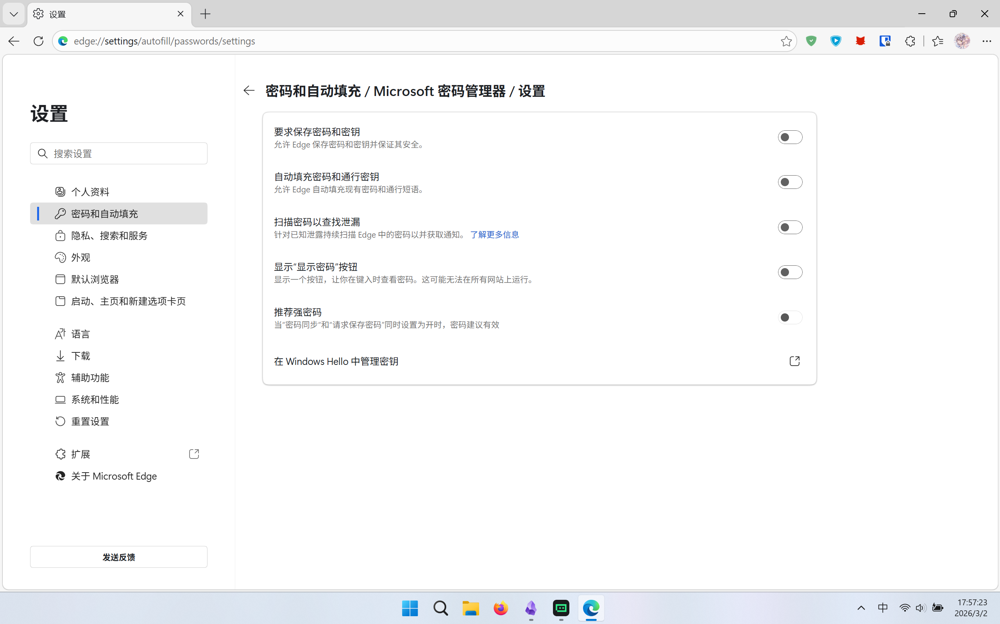
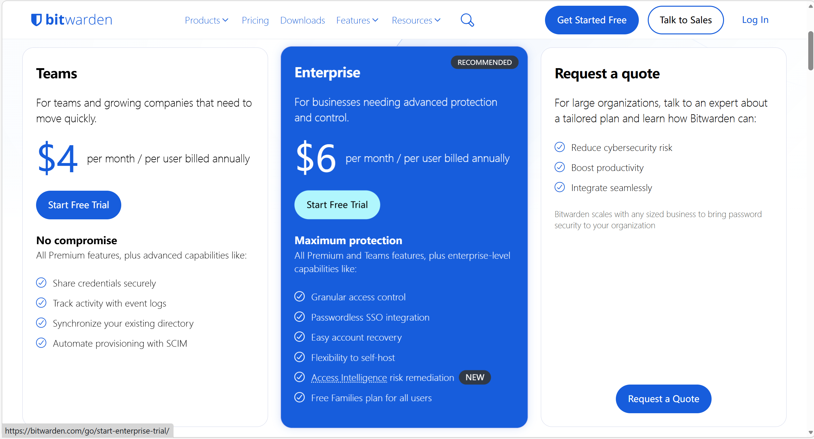
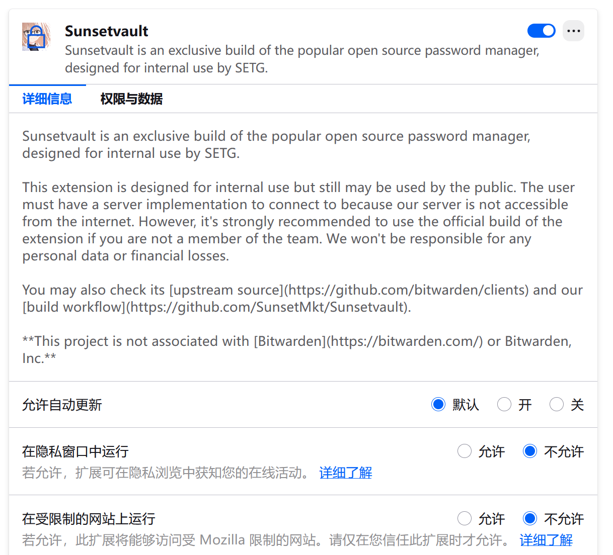

# 引言
从系统自带密码管理器到自建Bitwarden，再到发现免费使用官方服务的妙招，我的密码管理之路充满了折腾与惊喜。本文将分享这段经历，希望能给同样困扰的你一些启发。
# 密码管理器变更之旅
## 系统默认管理器
首先，最开始的密码管理器肯定还是各种系统或者浏览器的密码管理吧，我最开始用的就是小米官方的密码管理（居然不让截图，那就不放照片了）加这个edge的浏览器自动填充倒也算还可以

但是在某一天我知道了某个软件能够支持通行密钥登录啦，但是小米官方却是白名单机制（未在白名单里面的软件无法存入通行密钥），我的密码管理器之旅就正式开始了

## 官方bitwarden
最开始搜索密码库就搜到了bitwarden这个开源的软件，只有部分服务（OTP）收费，但是我只是为了通行密钥，所以倒还算可以，然后体验了几天，体验了到了全平台互通的爽感，但是OTP不可用确实是一个大问题，之前我都是用微软Authenticator的来着，有时候在浏览器登录被卡在2fa又要掏出手机，确实太麻烦了，开会员的话，bitwarden官方的会员又太贵了怎么办
## cloudflare自建bitwarden服务
项目的仓库地址：[github](https://github.com/afoim/warden-worker) 
这个项目对于一个电脑上没有安装rust以及各种环境变量的人来说简直是一个灾难，我那次就是，配环境配了两个小时，部署反而只花了十多分钟，这是我那天以后电脑上多出的软件
而且因为因为数据托管在cloudflare的D1数据库，断联也是常有的事，~~导致我红温的次数也不少~~ ，但至少是能用了。
## keyguard+Sunsetvault联动使用完全免费的bitwarden服务
手机上使用keyguard（请在[github](https://github.com/AChep/keyguard-app)下载，在谷歌商店下载的有部分功能缺陷），浏览器上面使用[sunsetvault](https://github.com/SunsetMkt/Sunsetvault)

直接使用 Bitwarden官方 ，你就不再需要有一台服务器来部署 [Vaultwarden](https://github.com/dani-garcia/vaultwarden) 或使用Rust在Cloudflare Worker上部署 [warden-worker](https://github.com/afoim/warden-worker) ，并且也可以收到官方的登录日志邮件，体验感对我来说是极好的，目前仍在使用
# 一些注意事项
> [!NOTE] 澎湃os的系统密钥填是有bug的，你可以通过这种方式来启用密钥
> 1. 你可以先选择无，再选择Edge/Google，然后其他服务选择Keyguard， 最后再把首选服务切换到KeyGuard，这样就能成功设置KeyGuard为默认密码管理器了。
>2. 也可以通过root后使用xposed模块来修复。

> [!NOTE] Edge/Chrome等手机版浏览器只调用谷歌密码管理器（没开就不会调用任何密码管理器） 
> 手机 Chrome/Edge 浏览器，可通过将 Flags（chrome://flags/#web-authentication-android-credential-management）设置为 false， 临时改用浏览器内的凭据管理器（扩展），即可实现传统的 Passkey/MFA 体验，正常利用包括硬件密钥在内的 Passkey 进行认证，登录网站。
# 参考文献 · 鸣谢
为此文的编写奠定基础 -
1.  [密码管理器折腾记：从微软背刺到 KeyGuard 真香](https://blog.weijx.vip/p/%E5%AF%86%E7%A0%81%E7%AE%A1%E7%90%86%E5%99%A8%E6%8A%98%E8%85%BE%E8%AE%B0%E4%BB%8E%E5%BE%AE%E8%BD%AF%E8%83%8C%E5%88%BA%E5%88%B0-keyguard-%E7%9C%9F%E9%A6%99)
2.  [魔幻嫁接！免费用上完全体的Bitwarden！](https://2x.nz/posts/bitwarden-com/)
3. [你可曾想过，直接将BitWarden部署到Cloudflare Worker？](https://2x.nz/posts/warden-worker/)
