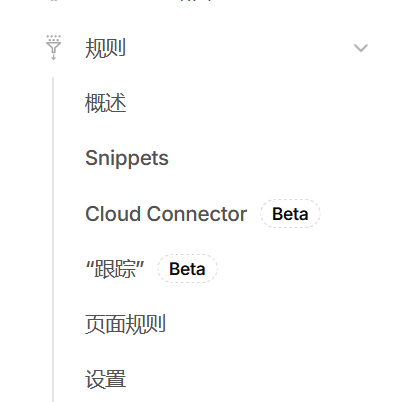
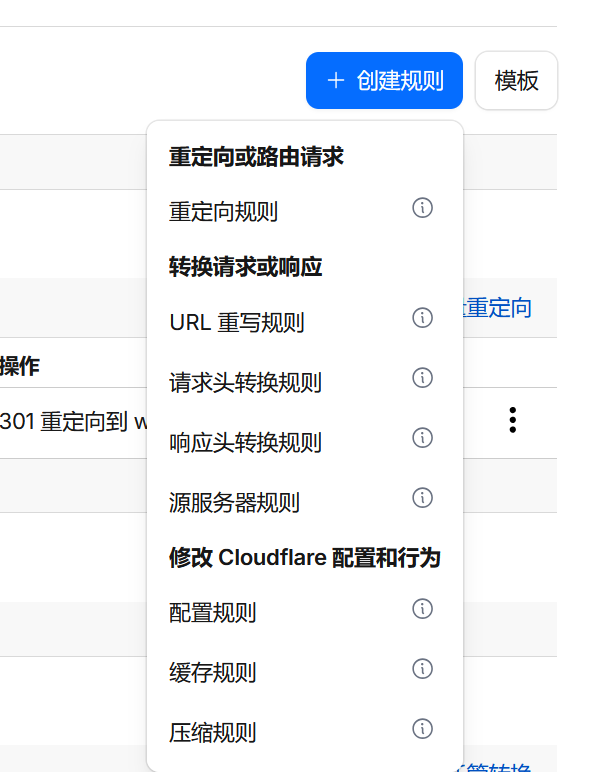

## 引言

> [!NOTE] 在换了网站域名以后有可能旧的网站还占在前面，这时候我们应该怎么应对呢
> 当然是用上301永久重定向了

> [!NOTE] 都是重定向，301和302有什么区别吗
> 301是永久的，告诉浏览器这个网站已经停用并且会跳转到新的网站，而302则是暂时重定向（常用于服务器错误/登录重定向页面）
> 

>[!NOTE] 为什么要做区分呢
>301会在浏览器内部留下缓存，除非清除浏览器数据，否则都是会一直重定向，但是会让搜索引擎提升网站的SEO

## 下面是在cloudflare上设置301的步骤

在cloudflare上设置

填入这些值
`规则名称 （必需）：自己能区分就好
`请求 URL： https://blog.example.com/*
`目标 URL： https://blog.example.cn/${1}
`状态代码：301`
`保留查询字符串：推荐勾选`
成功重定向，另外可以在cloudflare的dns记录里面把这个blog的canme记录改成A记录指向192.0.2.1（丢弃）
## 补充
1. 其他子域名/主域名也可以通过这种方式重定向来不影响自己的SEO
2. 这个是自用的，使用的是cf的新办法，还有老办法，可以自己查询AI